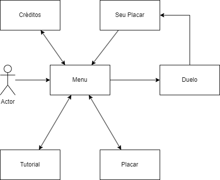

# `<Chemical Duel>`

## Motivação

A motivação desse projeto é desenvolver um jogo para a disciplina de Estágio Supervisionado I da Uni7.

## Objetivo

O objetivo do jogo é levar os Pontos de Vida do oponente à 0.

## Valor Agregado

Aprender como é desenvolvido um projeto, desde sua idealização, planejamento, desenvolvimento, testes e entrega.

## Fases

Serão 2 fases onde o jogador poderá escolher o seu adversário, cada um possuirá um deck diferente.

| Fases | Descrição |
| ----- | ----------- |
| 1     | O jogador enfrentará Antoine Lavoisier. |
| 2     | O jogador enfrentará Ernest Rutherford. |

## Esquema de Pontuação

Cada tipo de carta terá uma pontuação ao ser jogada, além disso outros fatores também aumentarão a pontuação do jogador, como a vitória no duelo por exemplo, ao final da partida será salvo o nome do jogador e sua pontuação total.

| Ação | Pontuação |
| ----- | ----------- |
| Sem Dano   | 100 pts |
| Vitória   | 50 pts |
| Jogar uma substância   | 20 pts |
| Jogar um elemento | 5 pts |
| Jogar uma alquimia     | 5 pts |

## Requisitos

### Épicos/Funcionalidades

1. `Menu Inicial`
   Tutorial;
   Iniciar;
   Placar;
   Créditos
2. `Seleção de Oponente`
   Personagem 1: Antoine Lavoisier;
   Personagem 2: Ernest Rutherford;
3. `Placar`
   Top 10 jogadores com a maior pontuação (Nome do jogador - Pontuação - Oponente);
4. `Créditos`
   Créditos;
5. `Fases`
   Cenário de cada fase;
   Jogador;
   Oponente;
   Cartas;
   Elementos de Comando;
   Músicas;

### Personas

1. **`<Jogador/Oponente#1>`** - `<Irá selecionar o oponente Antoine Lavoisier e jogar o jogo como Ernest Rutherford.>`.
2. **`<Jogador/Oponente#2>`** - `<Irá selecionar o personagem Ernest Rutherford e jogar o jogo como Antoine Lavoisier.>`.

## Protótipos de Tela

## Instalação

Valide se tem [Node.js](https://nodejs.org) instalado.

Clone esse repositório e entre na pasta

git clone https://github.com/SenaVitor/chemical-duels

execute o comando: npm install

### Rode o servidor

npm start

### Inicie o jogo

Entre na pasta client com o comando: cd/client
Após isso, rode o jogo com o comando: npm start

Para visualizar localmente abra 2 abas do: http://localhost:8080/.

## Tecnologias e Ferramentas utilizadas
- HTML - Linguagem de maração de hipertexto;
- JavaScript - Linguagem de programação;
- Node.js - Ambiente de execução;
- Phaser3 - GameEngine;
- Webpack - Ferramenta de Empacotamento;
- Firebase - Banco de Dados para armazenar o ranking.
